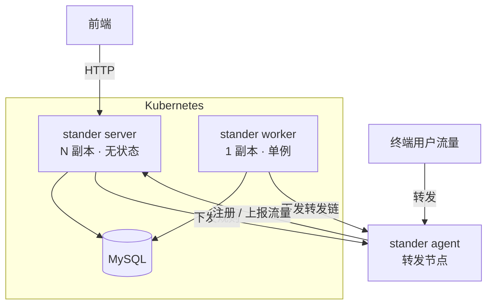
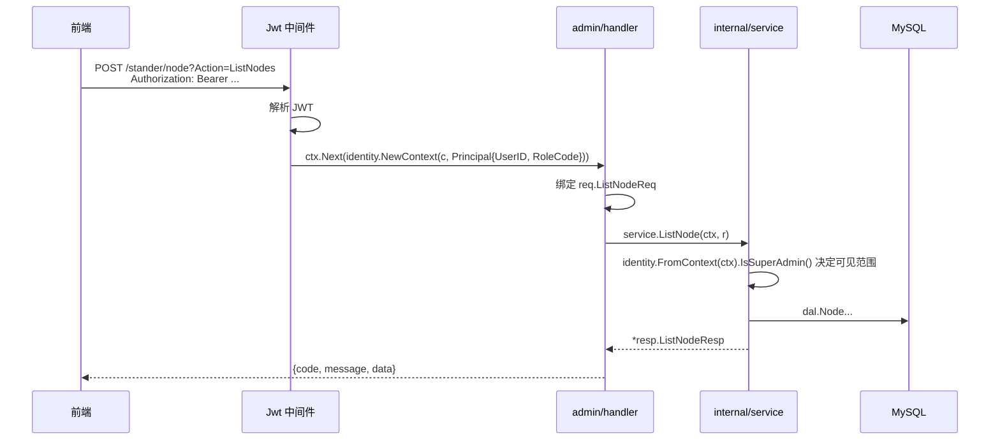

# 架构

## 组成

Stander 是一个端口转发系统，一个二进制通过 cobra 子命令决定入口：

| 子命令 | 职责 | 副本数 |
|---|---|---|
| `stander server` | HTTP API：控制台（根路径）+ 控制面（`/api/v1`） | 可任意扩 |
| `stander worker` | 单例后台任务：推进用户流量周期、下发转发链 | **必须恰好 1 个** |
| `stander agent` | 跑在转发节点上，执行实际的端口转发 | 每个转发节点 1 个 |
| `stander gen` | 从数据库重新生成 gorm-gen 代码 | 一次性 |



## 分层

```
api/                    HTTP 层：路由、参数绑定、action 分发、响应信封
  ├─ route.go           路由注册 + ControllerIdentity / AgentAuth 中间件
  ├─ dispatch.go        控制面 action 分发（泛型 call 辅助函数收口绑定）
  ├─ admin_route.go     控制台路由（两个端共用）
  └─ health.go          /healthz · /readyz
internal/
  ├─ admin/             控制台后端：handler / inout / middleware / model
  ├─ service/           领域逻辑（不依赖任何 web 框架）
  ├─ worker/            单例后台任务
  ├─ identity/          调用方身份（类型化 Principal，走 context.Context）
  ├─ model/{entity,dal} gorm-gen 产物
  ├─ forward/           转发数据面：connector · manager · selector
  ├─ client/            agent → 控制面、gost 客户端
  ├─ observability/     Prometheus 指标、结构化日志
  ├─ captcha/           数据库支撑的验证码存储
  ├─ config/ db/ server/ common/ utils/
```

### 唯一一条硬性依赖规则

**`internal/service` 不允许 import 任何 web 框架。**

每个领域动作的签名都是：

```go
func AddNode(ctx context.Context, r *req.AddNodeReq) (*resp.AddNodeResp, error)
```

参数绑定、响应写出留在 `api/`；调用方身份通过 `internal/identity` 放在标准
`context.Context` 里。这条边界由 `internal/service/boundary_test.go` 用
`go/build` 检查 import 列表来守住——不是靠约定，是会红的测试。

这样做的直接收益是 service 层可以脱离 HTTP 单测：

```go
ctx := identity.NewContext(context.Background(), identity.Principal{RoleCode: "USER"})
got, err := service.ListChainGroup(ctx, &req.ListChainGroupReq{})   // 没有 server，没有数据库
```

## 请求怎么流动

控制台的 `/stander/*` 是给前端用的门面。它在**进程内**直接调用
`internal/service`：



控制面 `/api/v1/*` 走同一套 service，区别只在于身份来自
`X-User-Id` / `X-Role-Id` 请求头（`ControllerIdentity` 中间件），响应信封是
`{Result}` 而不是 `{code, message, data}`。两种信封都是历史形成的，前端依赖，
没有改。

## 请求 id 与错误

### 每个响应都带一个 id

`api.RequestID` 是挂在最前面的中间件：读入站的 `X-Request-Id`，没有或者不像话就
生成一个（`observability.SanitizeRequestID`——这个头是调用方给的，会进日志行也会
进响应头，带空白、控制字符或者超长的一律换掉，否则可以伪造日志行、劈开响应头）。

id 放三个地方：标准 `context.Context`、web 框架自己的 per-request context（信封
是只拿得到后者的）、以及响应头。所以连没有信封的响应——验证码图片、`/metrics`、
panic——也带得上，而那恰恰是最需要查日志的几种。

访问日志换成了 `api.AccessLog`，因为 hertz-contrib 那个没法把 id 打进去；只出现
在响应里的 id 是没用的，重点就是拿它去日志里找对应那行。

    响应头 X-Request-Id: 46ecc9df-…        信封 "requestId": "46ecc9df-…"
    日志   request_id=46ecc9df-… kind=unauthenticated path=/auth/logout rejected="…"
    日志   request_id=46ecc9df-… status=200 latency=159µs method=POST route=/auth/logout

### 错误分类

`internal/apperr` 里的 `Kind` 是唯一的分类，别的都从它派生：信封里的 `code`、
机器可读的 `error` slug、控制面 API 的 HTTP 状态码、以及日志级别。

| Kind | code | slug | 什么时候 |
|---|---|---|---|
| InvalidArgument | 400 | `invalid_argument` | 请求本身不对：绑定失败、校验不过 |
| Unauthenticated | 401 | `unauthenticated` | 没有可用身份 |
| PermissionDenied | 403 | `permission_denied` | 身份没问题，但不能做这件事 |
| NotFound | 404 | `not_found` | 行不存在，或者对这个调用方不可见 |
| Conflict | 409 | `conflict` | 和已有数据冲突 |
| FailedPrecondition | 422 | `failed_precondition` | 请求没错，但系统状态不允许 |
| Unavailable | 503 | `unavailable` | 依赖的东西连不上 |
| Internal | 500 | `internal` | 我们自己的问题 |

在这之前，48 个 handler 全都回同一个魔数 `20001`——不管是请求体格式错、行不存在、
没权限，还是数据库挂了。客户端分不出来，只能把消息原样打出来；日志也没法决定哪些
该吵、哪些不用管。现在 `Kind.ServerFault()` 决定日志级别：调用方自己填错端口不值
一条 error，写库失败值。

两条纪律：

- **信封的 `code` 不是 HTTP 状态码。** 业务失败仍然回 HTTP 200，这是前端一直读的
  约定；真回 401/403 的话前端会当成"登录没了"，把人踢去登录页。控制面 `/api/v1`
  相反，它的客户端 `client.DoRequest` 只看状态码，所以那边照着 Kind 映射状态行。
- **cause 只进日志，不进响应。** SQL 文本、驱动报错、内部 id 都在 cause 里；
  调用方看到的是 `apperr` 的 Msg。

## 授权边界

只有一条：`identity.Principal.IsSuperAdmin()`，也就是 JWT 里的
`currentRoleCode` 是不是 `SUPER_ADMIN`。前端的两个端就是按它分的，所以它必须在
服务端真的拦得住东西——两个端由同一套 API 提供服务，用户端的账号手里握着的是一
个对每条路由都有效的 token，"用户端界面上没有这个入口"不构成任何限制。

它落在三个地方：

| 位置 | 管什么 |
|---|---|
| `middleware.SuperAdmin`（`api/admin_route.go`） | 账号管理那组路由：列表、新增、改、删、重置密码 |
| `service.requireSuperAdmin` | 只有管理员能做的领域动作：`ListUsers`、`EditUser`、`GetUserResources`、`SetUserResources`、`ListPlans`、`CreatePlan`、`AssociatePlan`、`AddNode`、`AddChainGroup`、`DelChainGroup` |
| 各动作自己的归属检查 | `checkRuleOwnership`（`AddRule` / `ModifyRule` / `ModifyRules` / `DelRule` / `TestRule`）、`checkUserNodePermission`、`checkUserChainPermission`、`scopeToCaller` |

### 资源授权跟被删掉的权限树不是一回事

`user_role_node_mappings` / `user_role_chain_mappings` 决定一个账号能用哪些节点
和链路。用户端的每一次读写都落在这上面：`ListNode` / `ListChain` 按它过滤，
`AddRule` 按它拒绝没授权的 id。

它跟删掉的 `permission` 表方向相反——那张表决定"菜单上显示什么"，路由根本不读它；
这两张表决定"能碰哪些真实资源"，service 层一直在强制执行。

管理端在 转发用户 › 资源授权 里维护它（`GetUserResources` / `SetUserResources`）。
在这个界面出现之前，只有"用户自己调 AddNode"会写这种行；而节点页现在是管理端的，
所以普通账号的用户端会永远是空的——授权界面是这次必须补上的一环，不是可选项。

把路由级的那层放在路由表里是有意的：读 `api/admin_route.go` 就能看出哪些接口属
于哪个端，不用去翻每个 handler。

两个配套的约束：

- **签发 token 的地方决定角色，没有第二处。** 只有登录会写 `currentRoleCode`，
  取自账号在 `user_roles_role` 里的角色。曾经还有一个
  `/auth/current-role/switch/:role`，拿路径参数重新签一个 token，而中间件把
  `currentRoleCode` 原样搬进 `Principal`——一个漏掉的校验就意味着任何 token 都能
  一次请求换来 `SUPER_ADMIN`。角色收敛成两个、一个账号一个之后它没有存在意义，
  删掉比校验对更省心。
- **列表接口要按调用者裁字段。** `entity.Node` / `entity.Chain` 会把 `key` 一起
  序列化出去，那是控制面命令 agent 用的凭证。非管理员的响应由
  `service.redactForCaller` 抹掉 `key` 和 `manager_ip`——前端不显示这两列不等于
  它们没发出去。

## 为什么 worker 必须是单例

`worker.ReconcileTrafficPlans` 会遍历所有用户，把流量周期推进到下一个周期。
两个 worker 同时跑会重复推进，用户的重置时间会被多加一个周期。

这也是 `stander server` 的 `--worker` 开关存在的原因：

- 单机部署：`stander server`（默认带进程内 worker），一个进程搞定
- 多副本部署：`stander server --worker=false` × N + `stander worker` × 1

## 状态放在哪

API 是无状态的。曾经不是——用户当期已用流量存在进程内一个 `sync.Map` 里，由
后台任务写、API 读。那个设计下 worker 一旦拆成独立进程，API 读到的永远是 0。

现在这个数由 `service.PeriodTrafficUsage` 从 `user_daily_traffic` 直接算出来。
它本来就是可推导的，缓存只是徒增一个跨进程失效的隐患。

验证码曾经是另一处进程内状态：答案放在 base64Captcha 的内存 store 里，session
cookie 只带 id。多副本下签发和校验通常不在同一个副本，登录会按 (N-1)/N 的概率
失败。现在答案存在 `captcha` 表里（`internal/captcha`），任何副本都能校验，
过期行由 worker 定期清理。

答案没有放进 session cookie——cookie store 是**签名**不是加密的，客户端可以直接
读出答案。

## 数据库

`sql/init.sql` 是唯一的建表脚本，14 张表。`internal/model/entity` 与
`internal/model/dal` 是 gorm-gen 从数据库反向生成的，不要手改——改表结构后跑
`stander gen` 重新生成。

`role` / `profile` 和 `user_roles_role` 在 gorm-gen 侧没有产物，是
`internal/admin/model` 下手写的 gorm 模型。`user` 表**只有** gorm-gen 的
`entity.User` 一份定义。

`user` 表**没有主键，也没有 username 的唯一索引**（`sql/init.sql` 里就是这样，
沿用自合并前的旧脚本）。两个后果：新账号的 id 只能靠 `max(id)+1` 手算——所以
`handler.User.Add` 用 `SELECT ... FOR UPDATE` 把并发创建串起来；重名也只能在代码
里挡——`Add` 会先查一次。想加唯一索引的话，得先处理掉库里已有的重名行：

```sql
select username, count(*) from user group by username having count(*) > 1;
```

原来还有 `permission` 和 `role_permissions_permission` 两张表，存的是上一版 Vue
前端的菜单树。前端不再按它建路由，两张表也就没有了读者，已经删掉，`sql/init.sql`
里不再建它们。

## 前端

`web/` 是控制台：React + TypeScript + shadcn/ui，构建成静态站点，和 Go 二进制
彻底分开——不 embed、不打进同一个镜像、可以独立发布。

### 两个端

一个站点，两套写死的路由，登录后按角色分流：

| 端 | 路径 | 谁进得来 | 有什么 |
|---|---|---|---|
| 管理端 | `/admin/*` | `SUPER_ADMIN` | 仪表盘、节点、链路、链路组、转发规则、流量套餐、转发用户、账号管理 |
| 用户端 | `/portal/*` | 其余所有角色 | 自己的流量与套餐、自己的转发规则、可用节点、个人资料 |

分流点只有一个：`identity.Principal.IsSuperAdmin()`。后端本来就只有这一条授权
边界——service 层要么把行限制在调用者自己的 `user_id` / 授权映射上，要么放开——
所以前端也就只有两个端，不多不少。前端的 `RequireSide` 只是把人送到属于他的那
一边，真正拦住越权的是 service 层，用户直接敲管理端的 URL 也拿不到别人的行。

菜单是两个常量：`web/src/app/admin/admin-nav.tsx` 和
`web/src/app/user/user-nav.tsx`，就放在路由表 `web/src/routes/index.tsx` 旁边。

**用户端在 `/portal` 而不是 `/user`**：`/user` 是账号接口的前缀，Ingress、
`web/nginx.conf` 和 vite 的 dev proxy 都会把它整个路由到后端，`/user/profile`
会打到 API 而不是前端。

这套东西以前是动态的：后端返回一棵 `permission` 树，每行带 `path`、`component`
（上一版 Vue 的文件路径）、`icon`、`order`，前端在运行时据此建路由和 tab。结果
是"页面存在"和"菜单可见"由两个地方分别决定，可以互相打架——新增一个页面必须同
时补一条数据库记录，漏了就是对谁都不可见，包括超级管理员（它拿到的是"所有顶级
记录"，不是"全部权限"）。现在路由表就是唯一的真相。

### 接口

它只调控制台那组接口（根路径下的 `/auth`、`/user`、`/role`、`/stander`），
`/api/v1` 那组是给 agent 和 gost 用的，前端不碰。

前端要迁就的是既有接口的三个特点：

- **业务失败时 HTTP 状态码仍然是 200**，成功与否只能看信封里的 `code`。
- **验证码的答案在服务端**（现在是 `captcha` 表），图片本身不含答案，
  session cookie 只带 id，所以取验证码和登录这两个请求必须带 cookie。
- **实体字段几乎全是指针**，JSON 里可能是 `null`。

推荐把前端和 API 放在同一个 origin 后面（`web/nginx.conf` 就是这么反代的）。
后端虽然开了 `AllowAllOrigins`，但跨域下验证码的 session cookie 还需要
`SameSite=None` 才能带上，同源部署省掉这一整类问题。
