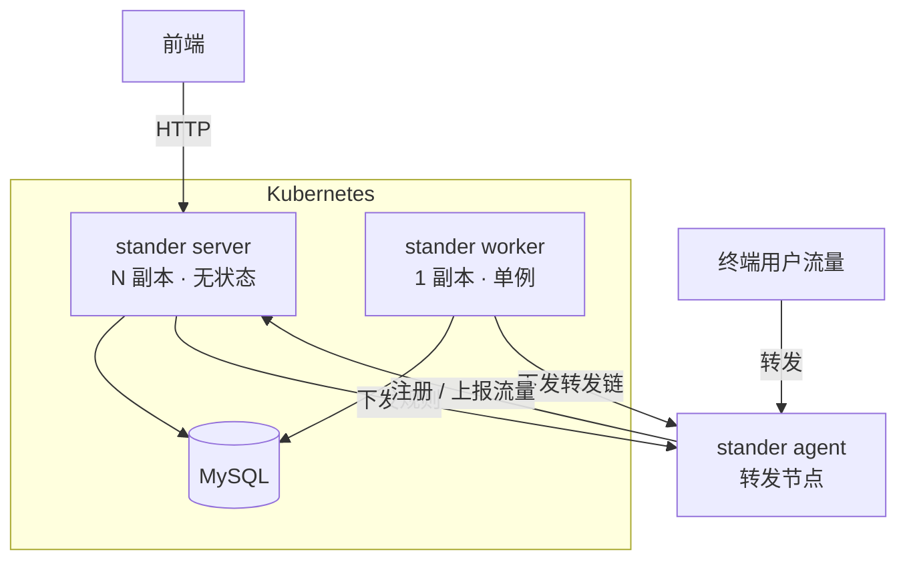
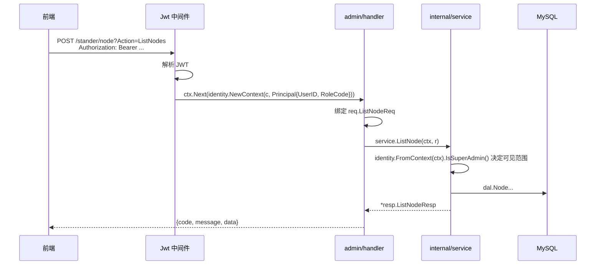

# 架构

## 组成

Stander 是一个端口转发系统，一个二进制通过 cobra 子命令决定入口：

| 子命令 | 职责 | 副本数 |
|---|---|---|
| `stander server` | HTTP API：管理后台（根路径）+ 控制面（`/api/v1`） | 可任意扩 |
| `stander worker` | 单例后台任务：推进用户流量周期、下发转发链 | **必须恰好 1 个** |
| `stander agent` | 跑在转发节点上，执行实际的端口转发 | 每个转发节点 1 个 |
| `stander gen` | 从数据库重新生成 gorm-gen 代码 | 一次性 |



## 分层

```
api/                    HTTP 层：路由、参数绑定、action 分发、响应信封
  ├─ route.go           路由注册 + ControllerIdentity / AgentAuth 中间件
  ├─ dispatch.go        控制面 action 分发（泛型 call 辅助函数收口绑定）
  ├─ admin_route.go     管理后台路由
  └─ health.go          /healthz · /readyz
internal/
  ├─ admin/             管理后台：handler / inout / middleware / model
  ├─ service/           领域逻辑（不依赖任何 web 框架）
  ├─ worker/            单例后台任务
  ├─ identity/          调用方身份（类型化 Principal，走 context.Context）
  ├─ model/{entity,dal} gorm-gen 产物
  ├─ forward/           转发数据面：connector · manager · selector
  ├─ client/            agent → 控制面、gost 客户端
  ├─ observability/     Prometheus 指标、结构化日志
  ├─ captcha/           数据库支撑的验证码存储
  ├─ config/ db/ server/ common/ utils/
```

### 唯一一条硬性依赖规则

**`internal/service` 不允许 import 任何 web 框架。**

每个领域动作的签名都是：

```go
func AddNode(ctx context.Context, r *req.AddNodeReq) (*resp.AddNodeResp, error)
```

参数绑定、响应写出留在 `api/`；调用方身份通过 `internal/identity` 放在标准
`context.Context` 里。这条边界由 `internal/service/boundary_test.go` 用
`go/build` 检查 import 列表来守住——不是靠约定，是会红的测试。

这样做的直接收益是 service 层可以脱离 HTTP 单测：

```go
ctx := identity.NewContext(context.Background(), identity.Principal{RoleCode: "USER"})
got, err := service.ListChainGroup(ctx, &req.ListChainGroupReq{})   // 没有 server，没有数据库
```

## 请求怎么流动

管理后台的 `/stander/*` 是给前端用的门面。它在**进程内**直接调用
`internal/service`：



控制面 `/api/v1/*` 走同一套 service，区别只在于身份来自
`X-User-Id` / `X-Role-Id` 请求头（`ControllerIdentity` 中间件），响应信封是
`{Result}` 而不是 `{code, message, data}`。两种信封都是历史形成的，前端依赖，
没有改。

## 为什么 worker 必须是单例

`worker.ReconcileTrafficPlans` 会遍历所有用户，把流量周期推进到下一个周期。
两个 worker 同时跑会重复推进，用户的重置时间会被多加一个周期。

这也是 `stander server` 的 `--worker` 开关存在的原因：

- 单机部署：`stander server`（默认带进程内 worker），一个进程搞定
- 多副本部署：`stander server --worker=false` × N + `stander worker` × 1

## 状态放在哪

API 是无状态的。曾经不是——用户当期已用流量存在进程内一个 `sync.Map` 里，由
后台任务写、API 读。那个设计下 worker 一旦拆成独立进程，API 读到的永远是 0。

现在这个数由 `service.PeriodTrafficUsage` 从 `user_daily_traffic` 直接算出来。
它本来就是可推导的，缓存只是徒增一个跨进程失效的隐患。

验证码曾经是另一处进程内状态：答案放在 base64Captcha 的内存 store 里，session
cookie 只带 id。多副本下签发和校验通常不在同一个副本，登录会按 (N-1)/N 的概率
失败。现在答案存在 `captcha` 表里（`internal/captcha`），任何副本都能校验，
过期行由 worker 定期清理。

答案没有放进 session cookie——cookie store 是**签名**不是加密的，客户端可以直接
读出答案。

## 数据库

`sql/init.sql` 是唯一的建表脚本，15 张表。`internal/model/entity` 与
`internal/model/dal` 是 gorm-gen 从数据库反向生成的，不要手改——改表结构后跑
`stander gen` 重新生成。

管理后台的 `role` / `permission` / `profile` 和两张关联表在 gorm-gen 侧没有产
物，是 `internal/admin/model` 下手写的 gorm 模型。`user` 表**只有** gorm-gen 
的 `entity.User` 一份定义。

## 前端

`web/` 是管理后台的界面：React + TypeScript + shadcn/ui，构建成静态站点，
和 Go 二进制彻底分开——不 embed、不打进同一个镜像、可以独立发布。

它只调管理后台那组接口（根路径下的 `/auth`、`/user`、`/role`、`/permission`、
`/stander`），`/api/v1` 那组是给 agent 和 gost 用的，前端不碰。

后端为此**没有任何改动**。前端要迁就的是既有接口的三个特点：

- **业务失败时 HTTP 状态码仍然是 200**，成功与否只能看信封里的 `code`。
- **验证码的答案在服务端**（现在是 `captcha` 表），图片本身不含答案，
  session cookie 只带 id，所以取验证码和登录这两个请求必须带 cookie。
- **实体字段几乎全是指针**，JSON 里可能是 `null`。

推荐把前端和 API 放在同一个 origin 后面（`web/nginx.conf` 就是这么反代的）。
后端虽然开了 `AllowAllOrigins`，但跨域下验证码的 session cookie 还需要
`SameSite=None` 才能带上，同源部署省掉这一整类问题。

菜单权限沿用 `permission` 表，但只用 `code`：那张表的 `component` 列存的是上一版
Vue 前端的文件路径，React 这边用不上，路由表是静态写在前端代码里的。
新增页面要在 `permission` 表补一条记录，否则菜单对谁都不可见——超级管理员看到的是
"所有顶级记录"，不是"全部权限"。`sql/web_menu.sql` 补的就是这个。
